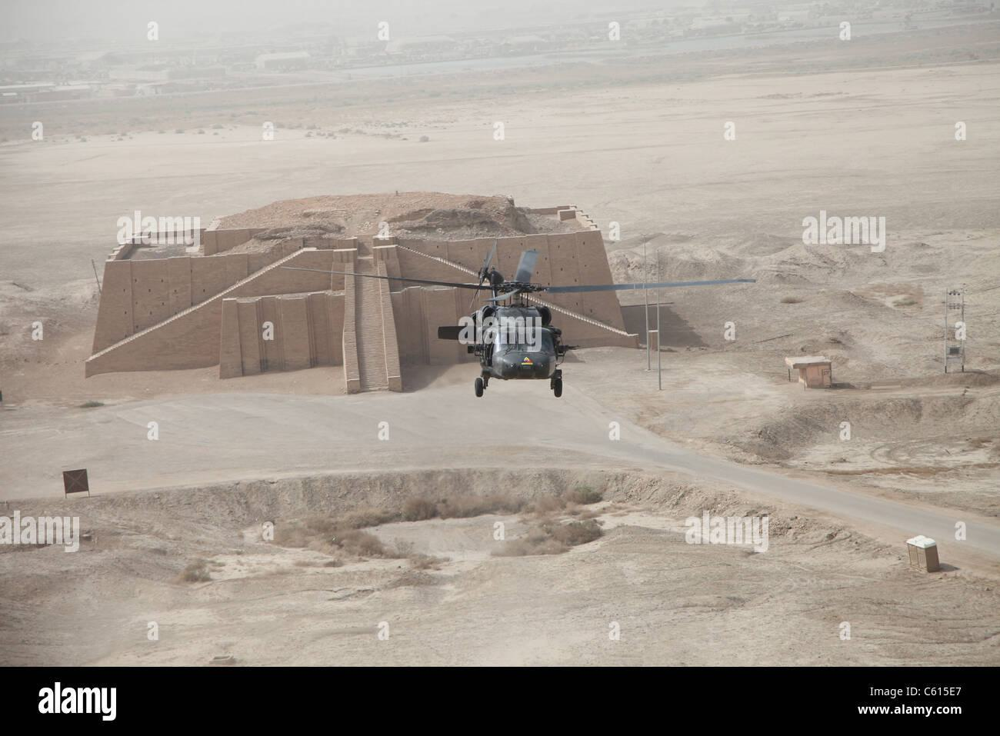
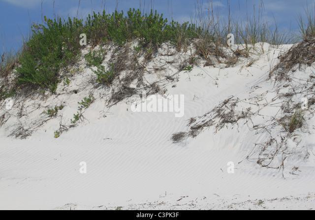

# Technical Interview Task 2

## Output 1: loss curve
[Wandb workspace](https://wandb.ai/wittgensteinian/tl_summer2023?workspace=user-wittgensteinian)

### Edit from Jun 8 11:00 AM submission
- Changing lr improved training very much (val_loss: 2.2 -> 1.2).
- Because I was short on time, I only used the first 300K(or 30K) images from the dataset for the new runs. This is roughly the 10% of the whole dataset.

### Ablation study on modules to which LoRA is applied
- Removing LoRA from FFN layers (so LoRA only applied on attention layers) is bad. This is interesting as original LoRA paper only applied LoRA to attention layers.

## Output 2: captioning results

|  |
|:-------------------------:|
|     <b> Caption: </b>     |
|   logo of the ad agency   |
|       <b> Id: </b>        |
|            100            |

|    |
|:---------------------------:|
|      <b> Caption: </b>      |
| a sand castle in the desert |
|        <b> Id: </b>         |
|             102             |

|                                                                                                                                                   |
|:--------------------------------------------------------------------------------------------------------------------------------------------------------------------------:|
|                                                                             <b> Caption: </b>                                                                              |
| tropical tropical tropical tropical tropical tropical tropical tropical tropical tropical tropical tropical tropical tropical tropical tropical tropical tropical tropical |
|                                                                                <b> Id: </b>                                                                                |
|                                                                                    103                                                                                     |

|               |
|:--------------------------------------:|
|           <b> Caption: </b>            |
| sand dunes and sand dunes on the beach |
|              <b> Id: </b>              |
|                  101                   |

### Setup
- Used checkpoint `abkx98e7`, trained on 300K images for 8 epochs (lr=1e-4).
- Used greedy decoding

### Results
- Caption generally captures the overall semantics of image.
- The model often fails to generate fluent sentences, a classic problem of text degeneration.

## Output 3: codebase
This repo itself.

## Appendix
